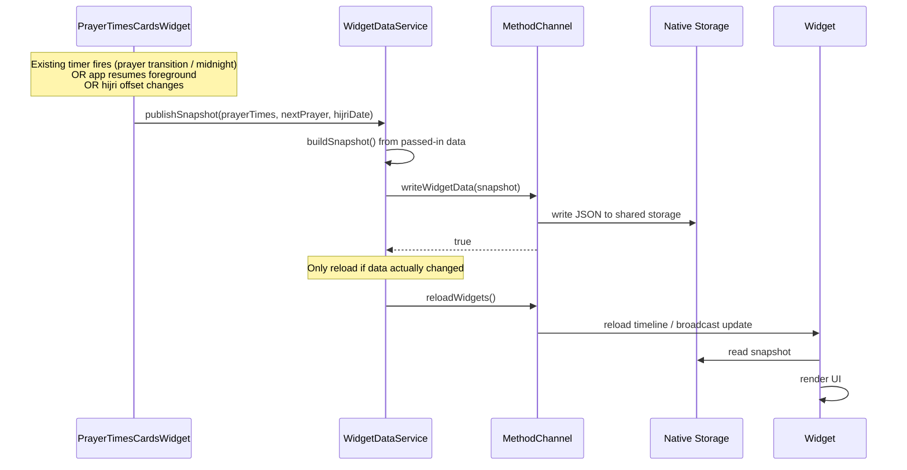
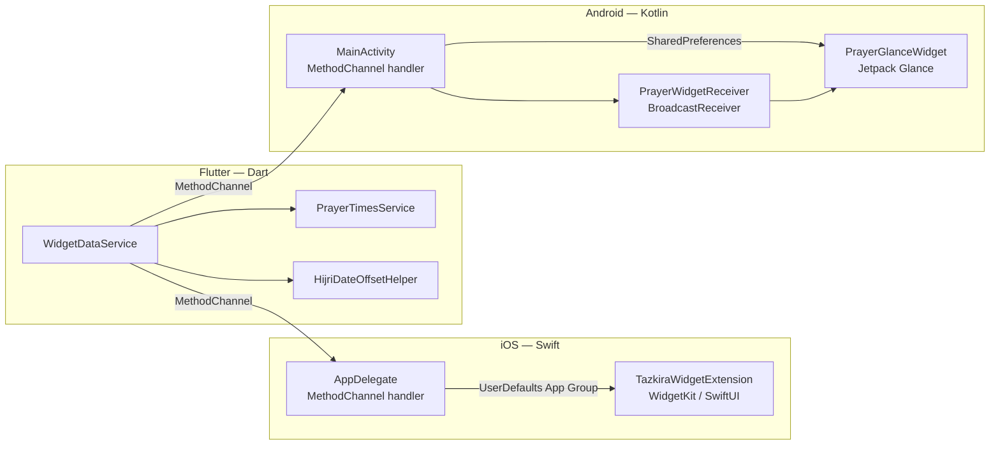

# Design Document — Prayer Times Widget

## Overview

This design describes how native Home Screen and Lock Screen widgets for the Tazkira app are built on both iOS and Android. The core constraint is that **no prayer-time calculation happens inside the native widget code** — the Flutter app owns all computation and pushes a pre-serialised snapshot to shared storage; the native widgets are purely display layers.

The design has three distinct layers:

1. **Flutter Data Bridge (`WidgetDataService`)** — reads prayer data **already calculated by the existing app**, serialises it, and publishes it to shared storage via a `MethodChannel`. It does **not** perform any prayer-time calculations of its own.
2. **iOS WidgetKit Extension** — Swift/SwiftUI target that reads shared storage and renders four widget families.
3. **Android Jetpack Glance AppWidget** — Kotlin component that reads `SharedPreferences` and renders with Material Design styling.

### Key Constraints

- iOS widgets use **only** `.widgetBackground` container backgrounds with no custom gradients — Apple native vibrancy style throughout, including the Lock Screen.
- Android widgets use the **App_Color_Teal** gradient (`#5A8C8C` → `#7CB9AD`) with 16 dp rounded corners.
- The `Cairo` font is used for all Arabic text on both platforms with a system Arabic fallback when unavailable.
- `sunrise` is **excluded** from all widget displays and from the stored snapshot.

---

## Architecture

### High-Level Data Flow

```mermaid
flowchart TD
    A[Flutter App\nWidgetDataService] -->|writes JSON via MethodChannel| B[iOS Native Handler\nAppDelegate.swift]
    A -->|writes JSON via MethodChannel| C[Android Native Handler\nMainActivity.kt]
    B -->|UserDefaults App Group\nkey: tazkira_widget_data| D[iOS Widget Extension\nTazkiraWidget.swift]
    C -->|SharedPreferences\nkey: flutter.tazkira_widget_data| E[Android Glance Widget\nPrayerWidget.kt]
    A -->|reloadWidgets()| B
    B -->|WidgetCenter.reloadAllTimelines()| D
    A -->|reloadWidgets()| C
    C -->|PrayerWidgetReceiver broadcast| E
```

### Refresh Trigger Flow



### Component Dependency Diagram



---

## Components and Interfaces

### 1. Flutter — `WidgetDataService`

**File:** `lib/core/services/widget_data_service.dart`

Responsibilities:
- Accept already-calculated prayer data from `PrayerTimesCardsWidget` and Hijri date from `HijriDateCard` — **no independent calculation**.
- Serialise the passed-in data into a `PrayerDataSnapshot` and write it via `MethodChannel`.
- Call `reloadWidgets()` **only when the snapshot content has actually changed** (next prayer name, any prayer time, or Hijri date differs from the previously written snapshot).
- Integrate into the **existing** `PrayerTimesCardsWidget` lifecycle — hooked into the widget's existing one-minute timer and `didChangeAppLifecycleState` observer already present in that widget, rather than introducing a separate lifecycle manager.
- No GPS polling, no retry loops, no location services — location is already handled by `PrayerTimesCardsWidget`.

```dart
class WidgetDataService {
  static const _channel = MethodChannel('com.moaz.tazkira/widget_channel');
  
  // Last published snapshot for change detection
  PrayerDataSnapshot? _lastSnapshot;

  /// Called by PrayerTimesCardsWidget whenever it has fresh prayer data.
  /// Only writes to storage and reloads widgets when data has changed.
  Future<void> publishSnapshot(PrayerDataSnapshot snapshot) async { ... }
  
  Future<void> _reloadWidgets() async { ... }
  Future<bool> isWidgetInstalled() async { ... }
  
  bool _hasChanged(PrayerDataSnapshot snapshot) { ... }
}
```

**Integration point:** `PrayerTimesCardsWidget._updateCountdown()` (already called by the existing `Timer.periodic`) calls `WidgetDataService().publishSnapshot(...)` after updating its own UI state. The `didChangeAppLifecycleState` already present in `PrayerTimesCardsWidget` triggers the same path on app resume. No new observer registration in `main()` is needed.

**`PrayerDataSnapshot` model** (Dart):

```dart
class PrayerDataSnapshot {
  final String fajr;              // ISO-8601 UTC
  final String dhuhr;             // ISO-8601 UTC
  final String asr;               // ISO-8601 UTC
  final String maghrib;           // ISO-8601 UTC
  final String isha;              // ISO-8601 UTC
  final String nextPrayerName;    // Arabic prayer name
  final String nextPrayerTime;    // ISO-8601 UTC
  final String hijriDate;         // Hijri_Date_Format
  final String snapshotTimestamp; // ISO-8601 UTC

  Map<String, dynamic> toJson();
  static PrayerDataSnapshot? fromJson(Map<String, dynamic> json);
  
  /// Equality check used for change detection — avoids unnecessary widget reloads.
  bool contentEquals(PrayerDataSnapshot other);
}
```

Note: `sunrise`, `latitude`, `longitude`, and `hijriOffset` are intentionally excluded from the snapshot. The widget never needs coordinates — it only displays what the app has already calculated.

### 2. Flutter — `WidgetChannelHandler` (iOS `AppDelegate.swift`)

**File:** `ios/Runner/AppDelegate.swift` (modified)

Handles three method calls:

| Method | iOS Implementation |
|---|---|
| `writeWidgetData(data)` | Encodes `data` as JSON string → writes to `UserDefaults(suiteName: "group.com.moaz.tazkira")` under key `tazkira_widget_data` → returns `true` |
| `reloadWidgets()` | Calls `WidgetCenter.shared.reloadAllTimelines()` |
| `isWidgetInstalled()` | Returns `true` (WidgetKit does not expose an install check API) |

### 3. Flutter — `WidgetChannelHandler` (Android `MainActivity.kt`)

**File:** `android/app/src/main/kotlin/com/moaz/tazkira/MainActivity.kt` (modified)

| Method | Android Implementation |
|---|---|
| `writeWidgetData(data)` | Writes JSON string to `SharedPreferences` (`FlutterSharedPreferences`) under key `flutter.tazkira_widget_data` → returns `true` |
| `reloadWidgets()` | Sends broadcast `com.moaz.tazkira.WIDGET_UPDATE` to `PrayerWidgetReceiver` |
| `isWidgetInstalled()` | Queries `AppWidgetManager` for active widget IDs |

### 4. iOS — `TazkiraWidgetExtension`

**Directory:** `ios/TazkiraWidget/`

Swift/SwiftUI target containing:

| File | Purpose |
|---|---|
| `TazkiraWidget.swift` | Entry point; declares all four `Widget` configurations in a `WidgetBundle` |
| `PrayerEntry.swift` | `TimelineEntry` model; wraps the parsed `PrayerDataSnapshot` |
| `PrayerTimelineProvider.swift` | Implements `TimelineProvider`; builds timeline with one entry per remaining prayer + midnight entry; `.atEnd` policy with 60-minute minimum |
| `SnapshotReader.swift` | Reads and parses JSON from `UserDefaults` App Group |
| `SmallWidgetView.swift` | systemSmall layout |
| `MediumWidgetView.swift` | systemMedium layout |
| `LargeWidgetView.swift` | systemLarge layout |
| `LockScreenWidgetView.swift` | accessoryRectangular layout |
| `PrayerFormatters.swift` | `formatTime(_:)` — converts ISO-8601 UTC → `Time_Format_AR` |

**Widget families declared:**

```swift
@main
struct TazkiraWidgetBundle: WidgetBundle {
    var body: some Widget {
        SmallPrayerWidget()   // systemSmall
        MediumPrayerWidget()  // systemMedium
        LargePrayerWidget()   // systemLarge
        LockScreenWidget()    // accessoryRectangular (iOS 16+)
    }
}
```

**Deep-link URL:** All tap targets use `.widgetURL(URL(string: "tazkira://home")!)` with a fallback to opening the app bundle identifier via `Link`.

**Background rule:** All four widget families use `.containerBackground(.widgetBackground, for: .widget)` — no custom colour or gradient anywhere.

**Font rule:** Attempt to load Cairo via `Font.custom("Cairo-Bold", size: 16)`. Fall back to `.system(.body, design: .default)` wrapped in `environment(\.locale, Locale(identifier: "ar"))`.

### 5. Android — Jetpack Glance `PrayerGlanceWidget`

**Directory:** `android/app/src/main/kotlin/com/moaz/tazkira/widget/`

| File | Purpose |
|---|---|
| `PrayerGlanceWidget.kt` | Extends `GlanceAppWidget`; implements `provideGlance()` |
| `PrayerWidgetReceiver.kt` | Extends `GlanceAppWidgetReceiver`; handles `APPWIDGET_UPDATE` and custom `com.moaz.tazkira.WIDGET_UPDATE` broadcasts |
| `SnapshotReader.kt` | Reads and parses JSON from `SharedPreferences` |
| `PrayerFormatters.kt` | `formatTime(isoString)` — converts ISO-8601 UTC → `Time_Format_AR` |
| `res/xml/prayer_widget_info.xml` | `AppWidgetProviderInfo` XML |

**Glance layout structure:**

```
Box (gradient background #5A8C8C → #7CB9AD, rounded 16dp)
  Column
    ─ Next Prayer Section (full width)
        Text "الصلاة القادمة"
        Text nextPrayerName
        Text nextPrayerTime (Time_Format_AR)
    ─ Prayer Row (RTL: الفجر → الظهر → العصر → المغرب → العشاء)
        For each prayer: Column(name, time) — highlighted if next
    ─ Hijri Date Text
```

**Highlight style:** The highlighted prayer column gets a white border `1.5dp` + `alpha = 1.0`; non-highlighted columns get `alpha = 0.6`.

**Tap action:** `actionStartActivity<MainActivity>()` from Glance.

---

## Data Models

### `PrayerDataSnapshot` — JSON Schema

```json
{
  "fajr":              "2025-07-14T01:43:00.000Z",
  "dhuhr":             "2025-07-14T10:04:00.000Z",
  "asr":               "2025-07-14T13:38:00.000Z",
  "maghrib":           "2025-07-14T16:55:00.000Z",
  "isha":              "2025-07-14T18:29:00.000Z",
  "nextPrayerName":    "المغرب",
  "nextPrayerTime":    "2025-07-14T16:55:00.000Z",
  "hijriDate":         "18 محرم 1447 هـ",
  "snapshotTimestamp": "2025-07-14T15:30:00.000Z"
}
```

Fields intentionally **excluded**: `sunrise`, `latitude`, `longitude`, `hijriOffset`.

### Staleness Detection

Both platforms check `snapshotTimestamp` on every render:

```
age = now − snapshotTimestamp
if age > 25 hours (strictly greater): show staleness indicator
```

- iOS: a small SF Symbol warning icon + greyed-out times.
- Android: all prayer time texts rendered at reduced alpha (greyed-out).

### Time Format — `Time_Format_AR`

Converts any ISO-8601 UTC `DateTime` to local time then:

```
hour12 = localHour % 12 (0 → 12)
period = localHour >= 12 ? "م" : "ص"
result = "${hour12.toString().padLeft(2,'0')}:${minute.toString().padLeft(2,'0')} $period"
```

Example: `04:13 ص`, `06:55 م`.

---

## Files to Create / Modify

### New Files — Flutter (Dart)

| Path | Description |
|---|---|
| `lib/core/services/widget_data_service.dart` | `WidgetDataService` class |
| `lib/core/models/prayer_data_snapshot.dart` | `PrayerDataSnapshot` model + JSON serialisation |

### Modified Files — Flutter (Dart)

| Path | Change |
|---|---|
| `lib/features/home/presentation/widgets/prayer_times_cards_widget.dart` | Hook `WidgetDataService.publishSnapshot()` into existing `_updateCountdown()` and `didChangeAppLifecycleState` — reuse existing lifecycle, no new observer |
| `lib/features/home/presentation/widgets/hijri_date_card.dart` | Expose the formatted hijri date string to `PrayerTimesCardsWidget` so it can be included in the snapshot |

### New Files — iOS (Swift)

| Path | Description |
|---|---|
| `ios/TazkiraWidget/TazkiraWidget.swift` | Widget bundle entry point |
| `ios/TazkiraWidget/PrayerEntry.swift` | `TimelineEntry` model |
| `ios/TazkiraWidget/PrayerTimelineProvider.swift` | Timeline builder |
| `ios/TazkiraWidget/SnapshotReader.swift` | App Group UserDefaults reader |
| `ios/TazkiraWidget/SmallWidgetView.swift` | systemSmall UI |
| `ios/TazkiraWidget/MediumWidgetView.swift` | systemMedium UI |
| `ios/TazkiraWidget/LargeWidgetView.swift` | systemLarge UI |
| `ios/TazkiraWidget/LockScreenWidgetView.swift` | accessoryRectangular UI |
| `ios/TazkiraWidget/PrayerFormatters.swift` | `formatTime` + `formatHijriDate` |
| `ios/TazkiraWidget/Info.plist` | Extension Info.plist |
| `ios/TazkiraWidget/TazkiraWidget.entitlements` | App Group entitlement |

### Modified Files — iOS

| Path | Change |
|---|---|
| `ios/Runner/AppDelegate.swift` | Add `MethodChannel` handler for `com.moaz.tazkira/widget_channel` |
| `ios/Runner/Info.plist` | Add `CFBundleURLTypes` with scheme `tazkira`; add App Group capability |
| `ios/Runner/Runner.entitlements` | Add `com.apple.security.application-groups: [group.com.moaz.tazkira]` |
| `ios/Runner.xcodeproj/project.pbxproj` | Add `TazkiraWidget` target, link WidgetKit + SwiftUI frameworks, set deployment target iOS 16.0 |
| `ios/Podfile` | Ensure minimum platform `ios '16.0'` |

### New Files — Android (Kotlin)

| Path | Description |
|---|---|
| `android/app/src/main/kotlin/com/moaz/tazkira/widget/PrayerGlanceWidget.kt` | Jetpack Glance widget implementation |
| `android/app/src/main/kotlin/com/moaz/tazkira/widget/PrayerWidgetReceiver.kt` | `GlanceAppWidgetReceiver` + custom broadcast |
| `android/app/src/main/kotlin/com/moaz/tazkira/widget/SnapshotReader.kt` | SharedPreferences reader + JSON parser |
| `android/app/src/main/kotlin/com/moaz/tazkira/widget/PrayerFormatters.kt` | ISO-8601 → Time_Format_AR |
| `android/app/src/main/res/xml/prayer_widget_info.xml` | `AppWidgetProviderInfo` |

### Modified Files — Android

| Path | Change |
|---|---|
| `android/app/src/main/kotlin/com/moaz/tazkira/MainActivity.kt` | Inherit `FlutterActivity` (instead of `AudioServiceActivity` — see note in Risks), add `MethodChannel` handler |
| `android/app/src/main/AndroidManifest.xml` | Register `PrayerWidgetReceiver`; add `WIDGET_UPDATE` intent-filter; add widget deep-link intent-filter; add `android:supportsRtl="true"` to `<application>` |
| `android/app/build.gradle` | Add Glance dependency |

### New Files — Android (Resources)

| Path | Description |
|---|---|
| `android/app/src/main/res/drawable/widget_background.xml` | Teal gradient shape drawable (fallback for pre-API 31 when Glance GradientBackground not available) |
| `android/app/src/main/res/font/cairo_regular.ttf` | Cairo font asset (copied from Flutter assets or downloaded) |
| `android/app/src/main/res/font/cairo_bold.ttf` | Cairo Bold font asset |

---

## Dependencies

### Flutter (pubspec.yaml additions)

| Package | Version | Reason |
|---|---|---|
| `flutter_app_group_directory` | `^1.1.0` | Read/write iOS App Group `UserDefaults` from Dart (used as reference; actual write happens via MethodChannel) |

> No new pub packages are strictly required for the MethodChannel approach; `shared_preferences` (already present) covers Android. `flutter_app_group_directory` may be used as a fallback direct-write path on iOS when the MethodChannel is unavailable.

### iOS (Podfile / Xcode)

| Framework | Version | Reason |
|---|---|---|
| `WidgetKit` | iOS 14+ (target: iOS 16) | Widget timeline and reload APIs |
| `SwiftUI` | iOS 14+ | Widget rendering |

No new CocoaPods dependencies are required; WidgetKit and SwiftUI are system frameworks.

### Android (build.gradle additions)

```groovy
implementation "androidx.glance:glance-appwidget:1.1.1"
implementation "androidx.glance:glance-material3:1.1.1"
```

---

## Correctness Properties

*A property is a characteristic or behavior that should hold true across all valid executions of a system — essentially, a formal statement about what the system should do. Properties serve as the bridge between human-readable specifications and machine-verifiable correctness guarantees.*

### Property 1: Snapshot excludes GPS and sunrise fields

*For any* `PrayerDataSnapshot` built from valid prayer data and serialised to JSON, the resulting JSON object must contain exactly the required fields (`fajr`, `dhuhr`, `asr`, `maghrib`, `isha`, `nextPrayerName`, `nextPrayerTime`, `hijriDate`, `snapshotTimestamp`), all non-null, and must **not** contain `sunrise`, `latitude`, or `longitude` fields.

**Validates: Requirements 1.8, 13.4**

---

### Property 2: JSON round-trip identity

*For any* `PrayerDataSnapshot` constructed from valid prayer data, serialising it to a JSON string (`toJson()` → `jsonEncode`), then parsing that string back (`jsonDecode` → `fromJson`), then re-serialising must produce a JSON string that is deeply equal to the original serialised form (same keys, same values, no data loss).

**Validates: Requirements 13.1, 13.2, 13.3**

---

### Property 3: Null fields are rejected before write

*For any* `PrayerDataSnapshot` in which one or more of the five required prayer time fields (`fajr`, `dhuhr`, `asr`, `maghrib`, `isha`) are `null`, `writeSnapshot()` must not write that snapshot to shared storage and must not crash.

**Validates: Requirements 13.4**

---

### Property 4: Null-safe time display

*For any* JSON string representing a prayer data snapshot in which one or more prayer time fields are `null` or contain an unparseable value, the `formatTime()` function used by both the iOS extension and Android widget must return the string `"—"` for those fields rather than throwing an exception or crashing.

**Validates: Requirements 13.5**

---

### Property 5: Change detection prevents unnecessary reloads

*For any* two `PrayerDataSnapshot` instances `a` and `b` where all five prayer times, `nextPrayerName`, `nextPrayerTime`, and `hijriDate` are identical, `a.contentEquals(b)` must return `true`, and calling `publishSnapshot(b)` after `publishSnapshot(a)` must not trigger a `reloadWidgets()` call.

**Validates: Design constraint: avoid unnecessary widget reloads**

---

## Error Handling

### Flutter Layer

| Scenario | Handling |
|---|---|
| `MissingPluginException` on MethodChannel call | Catch silently, skip `reloadWidgets()`, log warning |
| Platform channel call fails (non-MissingPlugin) | Log error, retry once after 5 seconds, continue without crash |
| `PrayerTimesCardsWidget` has no prayer data yet | Do not call `publishSnapshot()` — wait for the widget's existing initialization to complete |
| `hijri_date_offset` change | `HijriDateCard` rebuilds naturally; `PrayerTimesCardsWidget` reads updated hijri string on next timer tick and publishes if changed |
| Snapshot content unchanged | `WidgetDataService._hasChanged()` returns false; skip write and reload entirely |

### iOS Extension Layer

| Scenario | Handling |
|---|---|
| No snapshot in App Group UserDefaults | Display "افتح التطبيق لتحديث البيانات" |
| `snapshotTimestamp` > 25 hours old | Display warning icon + greyed-out times |
| Highlight logic throws | Catch, render all cards without highlight |
| Cairo font unavailable | Use `.system(.body, design: .default)` fallback |
| Deep-link `tazkira://home` fails | Fall back to opening app by bundle identifier |
| Lock Screen widget, no snapshot | Display "—" for prayer name and time |

### Android Widget Layer

| Scenario | Handling |
|---|---|
| No snapshot in SharedPreferences | Display "افتح التطبيق" in header, "—" for each prayer |
| JSON parse error | Treat as missing snapshot; display placeholder |
| `snapshotTimestamp` > 25 hours old (or absent/unparseable) | Grey out all prayer times |
| Highlight logic throws | Catch, render without highlight |
| Cairo font unavailable | Use system Arabic fallback |
| Widget tap / activity launch fails | Glance handles this at OS level; widget does not crash |

---

## Testing Strategy

### Unit Tests (Dart)

| Test | Description |
|---|---|
| `WidgetDataService` — no reload on identical snapshot | Call `publishSnapshot` twice with same data; assert `reloadWidgets` called only once |
| `WidgetDataService` — reload on next prayer change | Call `publishSnapshot` with new `nextPrayerName`; assert `reloadWidgets` called |
| `WidgetDataService` — reload on prayer time change | Call `publishSnapshot` with different fajr time; assert `reloadWidgets` called |
| `WidgetDataService` — reload on hijri date change | Call `publishSnapshot` with new `hijriDate`; assert `reloadWidgets` called |
| `WidgetDataService` — channel failure retry | Mock `MethodChannel` to throw once; assert single retry after 5 s, no exception propagated |
| `WidgetDataService` — `MissingPluginException` silent | Assert no crash, no write attempt after `MissingPluginException` |
| `PrayerDataSnapshot.toJson()` — excluded fields | Assert `sunrise`, `latitude`, `longitude` keys absent from JSON |
| `PrayerDataSnapshot.fromJson()` — unknown fields ignored | Assert parsing JSON with extra keys does not throw |
| `formatTime()` — null / invalid input | Assert `"—"` returned for null, empty, and non-ISO strings |
| `formatTime()` — valid UTC string | Assert output matches `HH:mm ص/م` pattern |

### Property-Based Tests (Dart — using `package:fast_check` or `package:checks` + custom generators)

> Use the [dart_check](https://pub.dev/packages/dart_check) or a similar PBT library. Each property test runs minimum **100 iterations**.

| Property | Generator | Assertion |
|---|---|---|
| **Property 1** — Snapshot field contract | `Arbitrary<PrayerDataSnapshot>` (random valid times, names, hijri strings) | All 9 required fields present, non-null; `sunrise`, `latitude`, `longitude` absent |
| **Property 2** — JSON round-trip | `Arbitrary<PrayerDataSnapshot>` (random valid times, names, hijri strings) | `encode(decode(encode(s))) == encode(s)` |
| **Property 3** — Null rejection | `Arbitrary<PrayerDataSnapshot>` with one random prayer time field forced to null | `publishSnapshot` does not call `writeWidgetData`; no exception |
| **Property 4** — Null-safe display | `Arbitrary<Map<String, dynamic>>` with random subset of prayer time fields null or garbage | `formatTime(field)` returns `"—"` for each bad field |
| **Property 5** — Change detection | `Arbitrary<(PrayerDataSnapshot, PrayerDataSnapshot)>` where all content fields equal | `contentEquals` returns `true`; no `reloadWidgets` call on second publish |

**Tag format for each property test:**
```dart
// Feature: prayer-times-widget, Property 1: Snapshot completeness for any coordinates
```

### Integration Tests

| Test | Description |
|---|---|
| iOS MethodChannel end-to-end | Run on simulator: call `writeWidgetData`, verify App Group UserDefaults contains the expected JSON key |
| Android MethodChannel end-to-end | Run on emulator: call `writeWidgetData`, verify SharedPreferences key `flutter.tazkira_widget_data` contains JSON |
| Widget reload broadcast | Verify `PrayerWidgetReceiver` receives `com.moaz.tazkira.WIDGET_UPDATE` after `reloadWidgets()` call |
| Deep-link routing | Tap widget URL `tazkira://home`, verify app navigates to home screen without duplicate route |
| Staleness detection (iOS) | Write snapshot with timestamp 26 hours ago, verify staleness indicator shown |
| Staleness detection (Android) | Same for Android widget |

### Smoke Tests

| Test | Description |
|---|---|
| Channel name constant | Assert `WidgetDataService._channel.name == 'com.moaz.tazkira/widget_channel'` |
| App Group identifier | Assert entitlement value is `group.com.moaz.tazkira` |
| `tazkira` URL scheme registered | Assert `Info.plist` contains scheme in `CFBundleURLTypes` |
| Widget provider registered | Assert `AndroidManifest.xml` contains `PrayerWidgetReceiver` with `APPWIDGET_UPDATE` filter |

---

## Risks

| Risk | Likelihood | Impact | Mitigation |
|---|---|---|---|
| **`MainActivity` inheritance conflict** — current `MainActivity` extends `AudioServiceActivity` (from `audio_service` plugin), not `FlutterActivity`. Changing the base class may break audio playback features. | High | Medium | Keep `MainActivity` extending `AudioServiceActivity`. Add the `MethodChannel` handler inside `configureFlutterEngine` which `AudioServiceActivity` exposes. Test audio features after the change. |
| **iOS App Group provisioning** — `group.com.moaz.tazkira` must be created in the Apple Developer Portal and added to both targets' provisioning profiles. Local builds may fail until profiles are updated. | High | High | Document the portal setup steps in the tasks file. Use Automatic Signing in Xcode and ensure the developer account has App Groups capability. |
| **Cairo font in widget extension** — Custom fonts must be explicitly bundled inside the widget extension target; fonts in the main app bundle are not automatically shared. | Medium | Low | Copy `Cairo` font files into the `TazkiraWidget` target resources. Test on device since simulator font rendering differs. |
| **Jetpack Glance API stability** — Glance 1.x has had breaking API changes between minor versions. | Low | Medium | Pin to `glance-appwidget:1.1.1`. Review release notes before upgrading. |
| **`WidgetCenter.reloadAllTimelines()` rate limiting** — WidgetKit throttles reload calls from the extension budget. Calling from the app (via the MethodChannel) is not subject to the same budget but should not be called excessively. | Low | Low | The `WidgetDataService` only calls `reloadWidgets()` after a successful `writeSnapshot()`, not on a polling timer. |
| **SharedPreferences key prefix on Android** — Flutter's `shared_preferences` plugin stores keys with a `flutter.` prefix. The Android widget must read `flutter.tazkira_widget_data`, not `tazkira_widget_data`. | Medium | High | Hard-code the full key `"flutter.tazkira_widget_data"` in `SnapshotReader.kt`; add a smoke test asserting the correct key. |
| **Lock Screen widget on iOS < 16** — `accessoryRectangular` family requires iOS 16+. The widget bundle declaration uses `@available(iOS 16.0, *)`. | Low | Low | Wrap `LockScreenWidget()` in `#if os(iOS)` + `@available(iOS 16.0, *)` guard. Widget extension deployment target is iOS 16. |
| **GPS coordinate precision loss during JSON serialisation** — `double` values may lose precision when serialised as JSON numbers in some implementations. | Low | Low | Use Dart `jsonEncode` which preserves `double` precision to 15+ significant digits; add assertion in Property 5 with tolerance `1e-6`. |
